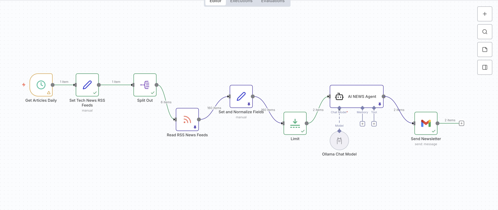

# AI Tech News Newsletter Automation

This tool auto-grabs daily tech news, summarizes it with AI, and emails it to you. Uses RSS feeds, AI, and Gmail.

## Quick Overview
1. **Fetch news** from tech sites (e.g., TechCrunch, The Verge).
2. **Clean** to top articles.
3. **AI summarize** into short, fun reads.
4. **Email it** daily to your list.

## How It Works (Step-by-Step)
- **Daily Trigger**: Runs every 24 hours.
- **RSS Feeds**: List like `https://techcrunch.com/feed, https://www.theverge.com/rss`.
- **Parse Feeds**: Pull title, link, description, date.
- **Clean Data**: Fix formats.
- **AI Magic**: llama3.2 model makes quick summaries + highlights.
- **Send Email**: Via Gmail to subscribers (e.g., `team@example.com`).

## Sample Email
**Daily Tech Digest**  
- **Sample mail**:[Gmail - Daily Tech Newsletter](Gmail-DailyTechNewsletter.pdf)
   

## Setup Basics
| What | Info | Example |
|------|------|---------|
| RSS List | Comma-separated URLs | `https://techcrunch.com/feed, https://www.theverge.com/rss` |
| Schedule | When to run | Daily at 8 AM |
| Emails | Who gets it | `you@example.com` |

## Tips
- Add Gmail keys for sending.
- Swap AI to GPT if you want.

## Why Use It?
- Hands-free news curation.
- Short & clear updates.
- No spam, just essentials.

## Tools
- **Automation**: n8n-like workflow.
- **News**: RSS.
- **AI**: llama3.2.
- **Email**: Gmail.

**By:** Legion  
**Goal:** Easy daily AI tech news.